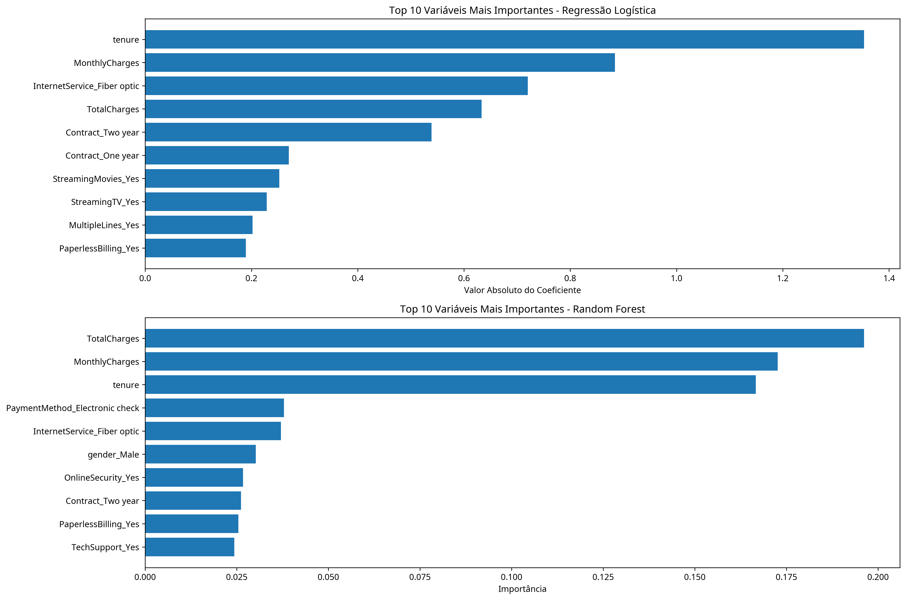

# Previsão de Churn na Telecom X

Este projeto tem como objetivo prever a evasão (churn) de clientes da Telecom X utilizando modelos de Machine Learning. O conjunto de dados `TelecomX_Data.json` possui informações de 7.267 clientes em formato JSON hierárquico que foram achatadas e tratadas para treinamento.

## Estrutura do Projeto
- `data/`: dados brutos e processados
- `notebooks/`: scripts para pré-processamento, análise e modelagem
- `models/`: modelos treinados
- `reports/`: relatórios e figuras gerados

## Criação do Ambiente
```bash
python -m venv .venv
source .venv/bin/activate
# instale as dependências a partir do arquivo na raiz do projeto
pip install -r requirements.txt
```

## Testes
Para executar a suíte de testes, utilize:
```bash
pytest
```

## Execução
Após ativar o ambiente, execute:
```bash
python notebooks/01_data_preprocessing.py   # processamento dos dados
python notebooks/02_exploratory_analysis.py # análise exploratória
python notebooks/03_model_development.py    # treinamento dos modelos
pytest                                      # executa os testes (se houver)
```

## Métricas Finais
O melhor desempenho foi obtido com **Regressão Logística**, alcançando acurácia de **0.8010** e F1-Score de **0.5795** no conjunto de teste.

## Figuras Principais




Consulte `reports/report.md` para análise completa e mais resultados.
